# Hướng dẫn sử dụng Blynk-Gate

## 1. Tổng quan
### 1.1. Giới thiệu về Blynk và phần cứng Blynk-gate

- Blynk là một nền tảng IoT cung cấp các công cụ để kết nối, quản lý và điều khiển các thiết bị IoT từ xa thông qua mạng Internet. Điểm nổi bật của Blynk là sự dễ dàng và nhanh chóng trong việc tạo và quản lý các ứng dụng IoT, phù hợp cho cả những người mới bắt đầu và những nhà phát triển chuyên nghiệp.
- Bằng cách sử dụng phần cứng **Blynk Gate** người dùng không cần phải code mà chỉ cần thao tác tùy chỉnh cơ bàn là đã có thể tạo ra 1 thiết bị điều khiển từ xa thông qua intermet.

### 1.2. Sơ đồ mạch Blynk-gate

  

Mặt dưới   

   

 Mặt trên  

### 1.3. Chức năng các chân trên mạch
- 5V: Chân cấp nguồn dương 5V
- GND: Chân cấp nguồn âm 0VDC
- SDA: Chân truyền nhận tín hiệu I2C  
- SCL: Chân tín hiệu xung nhịp I2C
- P1 -> P4: Chân OUTPUT điều khiển thiết bị 
- *Lưu ý: Khi chân J1 không được hàn thì chân SDA, SCL có chức năng giao tiếp I2C, nếu chân J1 được hàn lại thì 2 chân SDA, SCL sẽ không còn chức năng giao tiếp I2C mà sẽ là 2 chân OUTPUT tín hiệu giống như các chân P1 -> P4.*
## 2. Hướng dẫn tạo tài khoản Blynk
### 2.1. Tạo tài khoản trên trang web

#### **Bước 1**: PC/ Laptop: Truy cập link Blynk: <https://blynk.io/> 

#### **Bước 2**: Bấm vào nút 'LOGIN'

#### **Bước 3**: Chọn Create new acccount 

-	Tiến hành nhập Email và mật khẩu để tạo tài khoản mới 

## 3.	  Hướng dẫn sử dụng Blynk – gate để bật tắt đèn Led
### 3.1. Kết nối phần cứng

#### 3.1.1. Danh sách linh kiện
- 1x BlynkGate
- 1x relay 5v High/low
- 1x bóng đèn 220VAC
- Dây cắm
- Nguồn adapter 5V
#### 3.1.2. Sơ đồ kết nối

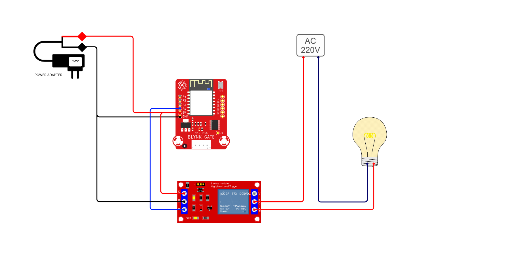

### 3.2.	Setup trên Blynk

#### **Bước 1**: Tại giao diện chính của Blynk, chọn “For Makers”
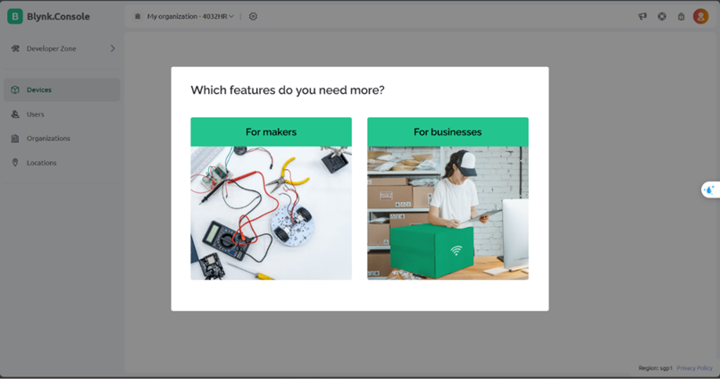

#### **Bước 2**: Thiết lập một template mới dùng để điều khiển dự án đèn Led tắt bật theo ý muốn, ấn chọn “New template”
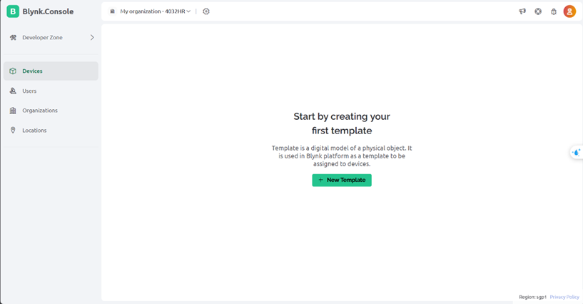

          

#### **Cách tạo một template mới**
- Name: Đặt tên bất kì cho template.
- Hardware: Chọn mặc định ESP8266.
- Connection Type: Wifi.
- Description: Phần mô tả chi tiết thêm cho template.

#### Bước 3: Sau khi đã tạo một template mới, cần thiết lập  Datastreams (tạo mới các chân Virtual Pin) 
 

Chọn New Datastream -> Virtual Pin

Khai báo thông số Virtual Pin tương tự như ảnh cho chân P1, đối với các chân còn lại (P2, P3, P4) khai báo tương tự nhưng chỉnh lại phần **Name và PIN** tương ứng.

#### **Bước 4**: Chỉnh sửa giao diện Web

- Kéo thả **Switch** vào giao diện điều khiển

 
  

- Nhấn vào **icon** cài đặt 

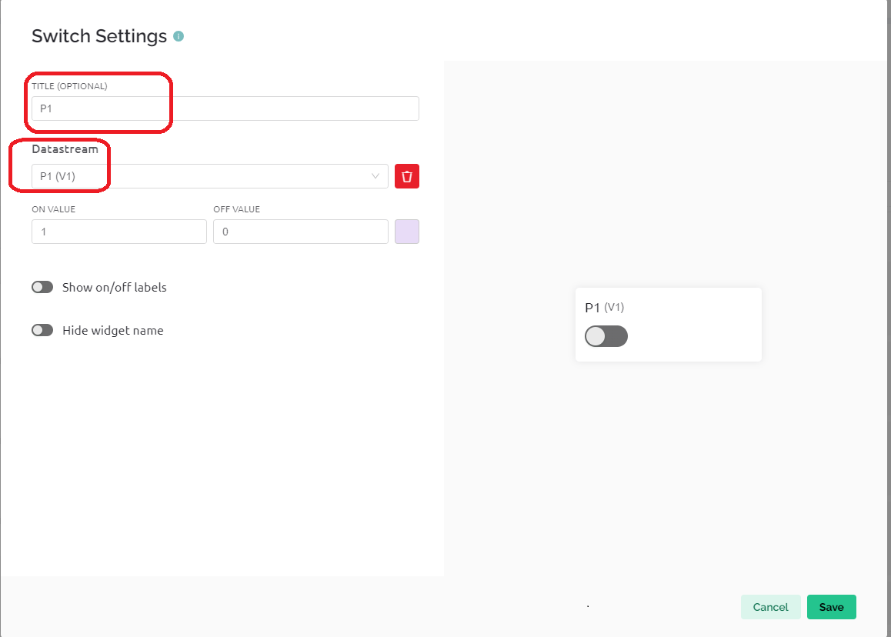
-  Tại Datastream chọn **Virtual Pin 1**
- Sau khi chỉnh sửa xong thì nhấn **"Save"**
- Các Switch khác cũng làm tương tự nhưng thay **Virtual Pin 1** thành **Virtual Pin** khác tương ứng. 
- Tiếp theo nhấn **"Save And Apply"**

Bước 7: Quay về thẻ Home và nhấn **"Add first device”**  hoặc **"New Device"** để đặt tên cho thiết bị điều khiển Sau đó nhấn **"Create"**.
 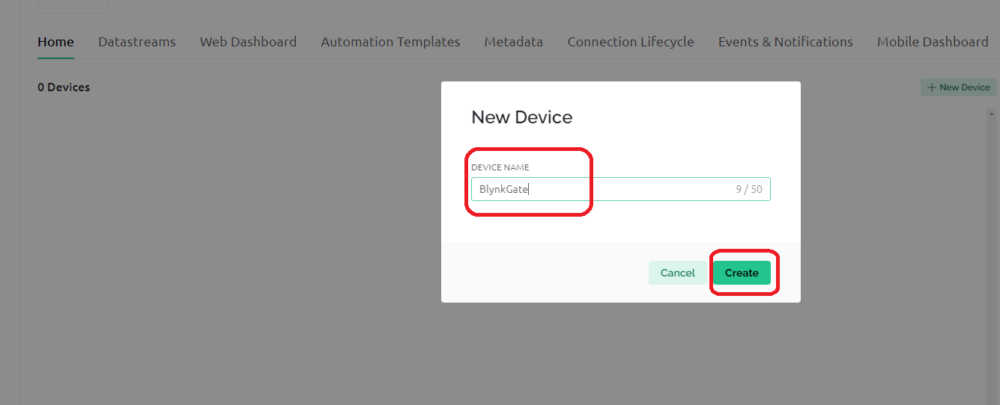

## 3.3. Thiết lập Blynk trên điện thoại:
IOS/Android: Truy cập “App Store” /” Google Play” và tải app “Blynk IoT”
- Sau khi tải app, chúng ta đăng nhập vào tài khoản đã tạo ở trang web
- Tiếp theo nhấn vào Add Device

  
  
  - Chọn Manually from template  

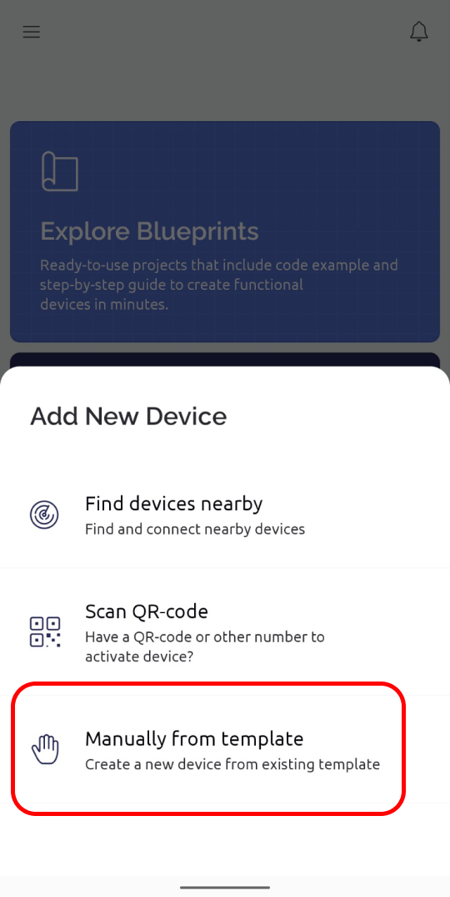  
  
  - Chọn thiết bị "ở đây mình đặt tên là BlynkGate nên mình sẽ chọn là BlynkGate". 
    
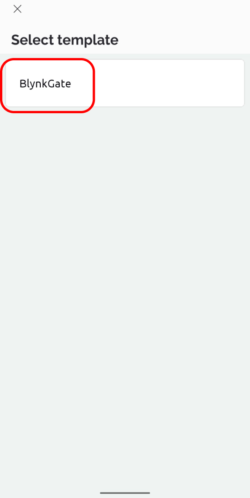 
  
  - sau đó nhấn **Create**  

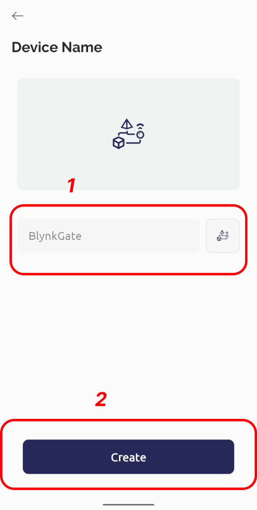  
  
  - Bấm vào biểu tưởng cài đặt bên góc phải màn hình

  
  

  
  
  - chọn **Button**

- Nhấn vào biểu tượng **OFF** trên màn hình
 
  
 - Chọn Datastream là **P1**, và Mode là **Switch**. 
  - Nhấn dấu x bên trái màn hình để thoát
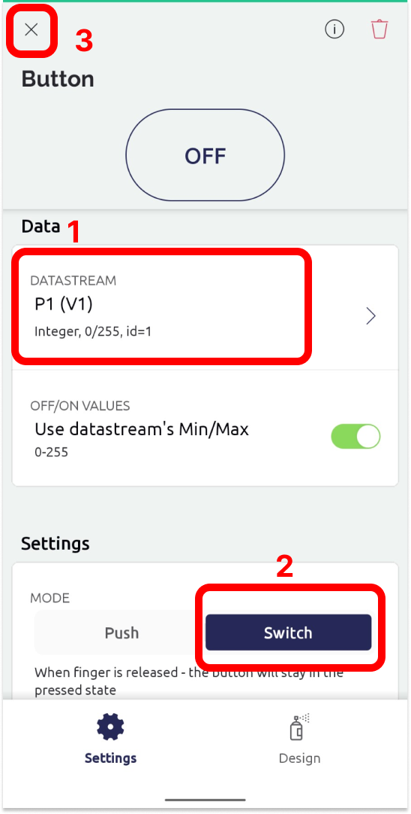
  
- Nhấn dấu mũi tên   :arrow_left: bên góc trái để trở về giao diện điều khiển  

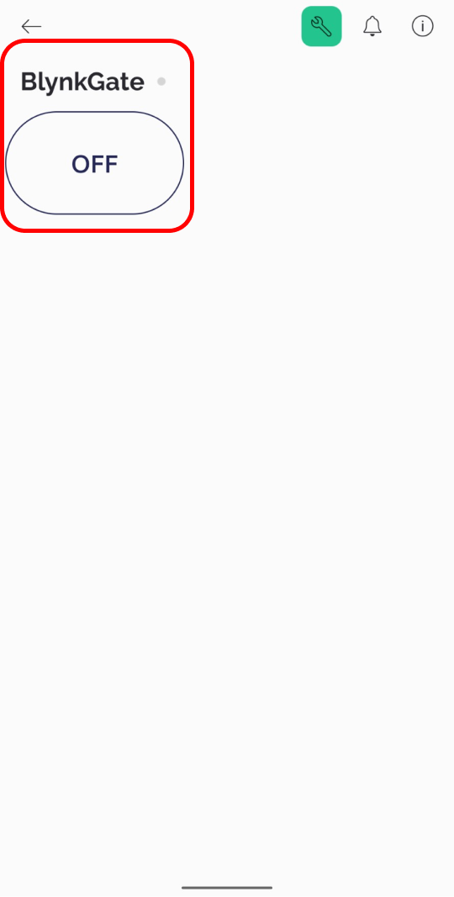

 
## 4.	 Hướng dẫn cài đặt BlynkGate
### 4.1. Cách lấy Auth Token
- Truy cập lại vào web blynk, nhấn vào biểu tượng **Devices**, sau đó nhấn vào **BlynkGate**
  

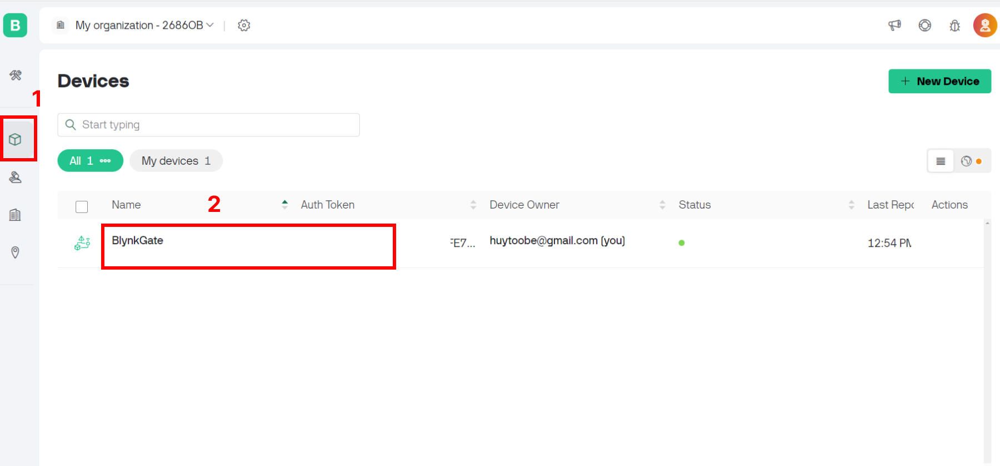
    
- Nhấn vào biểu tượng **Developer tools**  

  
- Nhấp chuột vào mục được khoanh đỏ để coppy **Auth token** sau đó pass vào mục tin nhắn hoặc lưu trữ vào file .txt

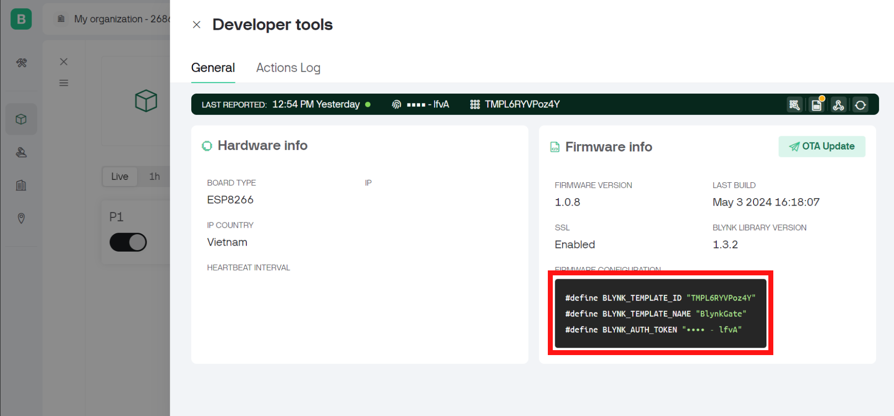
### 4.2. Cấu hình BlynkGate

> Note: Kiểm tra đèn tín hiệu trên BlynkGate
> \- Đèn tín hiệu chợp tắt liên tục: trạng thái cấu hình thiết bị
> \- Đèn tín hiệu chớp tắt chậm: trạng thái đã được cấu hình
> ** Để khôi phục cài đặt ban đầu hoặc muốn thay đổi wifi kết nối, 
     nhấn giữ nút SET trong 10s cho tới khi thấy đèn chớp tắt liên tục, 
     ngắt nguồn và kết nối nguồn lại.   
- Truy cập vào Wifi BlynkGate

Bước 1: Truy cập vào trình duyệt Web, nhập địa chỉ "192.168.4.1" 
Bước 2:  Điền tên wifi và pass wifi
Bước 3: Điền **Auth Token** đã lấy trước đó vào ô `Auth token`
Bước 4: Tại ô **Virtual pin for**... điền theo hình bên dưới
Bước 5: Nhấn Apply để hoàn thành quá trình cài đặt. (Để ý đèn xanh trên Blynk – gate chớp nhanh vài giây và sáng  sau kết nối nghĩa là kết nối thành công)

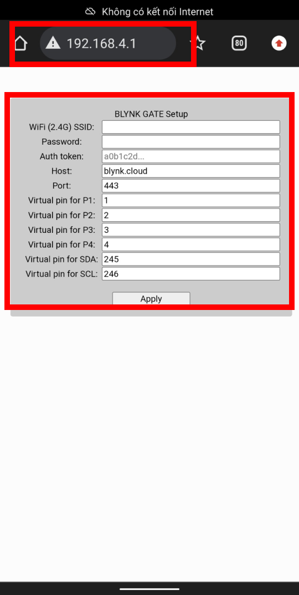
  
> Sau khi kết nối thành công thì sử dụng điện thoại để bật tắt đèn xem có được chưa nhé.^^

